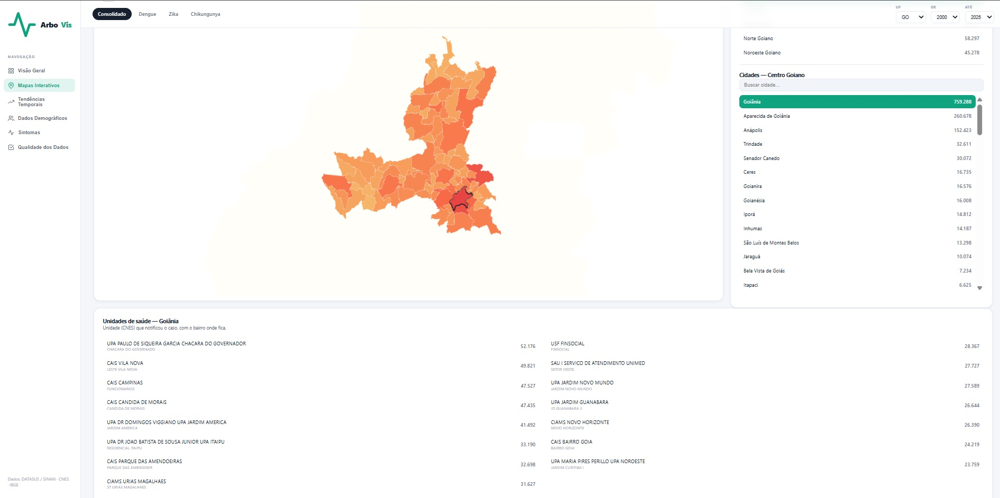
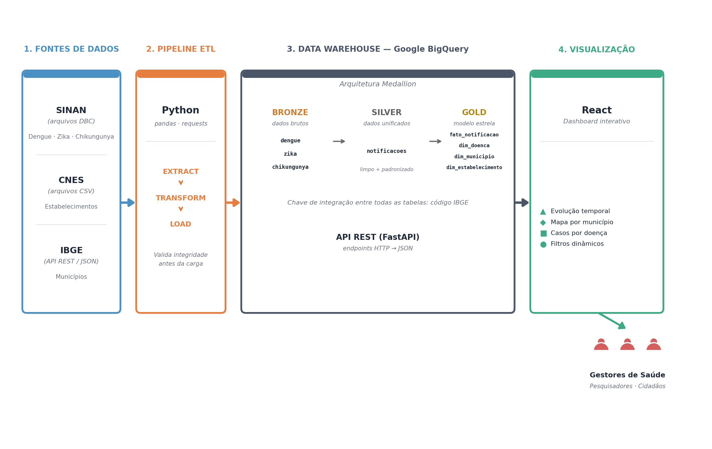
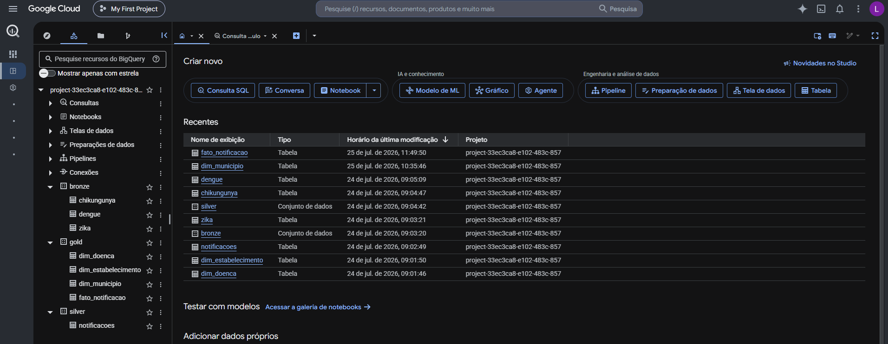

# ArboVis — ETL para Analise de doenças causadas pelo Aedes Egypti

<p align="center">
  
</p>

O **ArboVis** é uma plataforma que automatiza a coleta e visualização de dados públicos de arboviroses (Dengue, Zika e Chikungunya) no Brasil. A ideia é pegar informações que já existem, mas ficam espalhadas em fontes antigas e de difícil acesso do SUS, e transformar tudo em um painel que gestores de saúde consigam realmente usar.

Este é o meu TCC do curso de Análise e Desenvolvimento de Sistemas do IFG - Câmpus Jataí.

---

## O que a plataforma faz

- Baixa os arquivos DBC do SINAN direto do servidor FTP do DATASUS
- Consome a API do IBGE para consolidar os códigos de município
- Organiza tudo no Google BigQuery seguindo a arquitetura Medallion (Bronze, Silver, Gold)
- Expõe os dados tratados via uma API REST em FastAPI
- Renderiza um dashboard em React com filtros por município, período e tipo de doença
- Mostra a evolução dos casos em gráficos temporais e mapas coropléticos

---

## Arquitetura

<p align="center">
  
</p>

O sistema tem três camadas bem separadas: a de ingestão faz o trabalho pesado do ETL em Python, a de armazenamento persiste tudo no Google BigQuery seguindo o padrão Medallion, e a de aplicação junta a API em FastAPI com o frontend em React.

---

## Modelagem do Data Warehouse

<p align="center">
  
</p>

O DW segue a arquitetura Medallion, com três datasets no BigQuery:

- **bronze** — dados brutos separados por arbovirose (`dengue`, `zika`, `chikungunya`), preservando o formato original da extração
- **silver** — tabela `notificacoes` unificada, com dados limpos e padronizados
- **gold** — modelo dimensional em estrela: `fato_notificacao` conectada às dimensões `dim_doenca`, `dim_municipio` e `dim_estabelecimento`

A integração entre as camadas usa o código IBGE como chave, validada pelo pipeline ETL antes da carga.

---

## Stack

**Backend**
- Python 3.11+
- FastAPI
- pandas, requests, google-cloud-bigquery

**Data Warehouse**
- Google BigQuery

**Frontend**
- React 18 + Vite
- Tailwind CSS
- Recharts (gráficos)
- Leaflet.js (mapas)

---

## Estrutura de pastas

```
arbovis/
├── frontend/             # Aplicação React
├── scripts/              # Pipelines de carga e notebooks
├── sql/                  # Modelagem do DW (Bronze, Silver, Gold)
├── src/
│   └── arbovis/
│       ├── api/          # Endpoints FastAPI
│       ├── extract/      # Extração (SINAN, CNES, IBGE)
│       ├── transform/    # Sanitização e padronização
│       └── load/         # Carga no BigQuery
└── .env.example
```

---

## Rodando localmente

Você vai precisar de Python 3.11+, Node.js 18+ e uma conta no Google Cloud com o BigQuery habilitado.

Clone o repositório e configure o ambiente:

```bash
git clone https://github.com/luizferraz/arbovis.git
cd arbovis
cp .env.example .env
```

Edite o `.env` com o ID do seu projeto no GCP e o caminho da service account. Depois, sobe o backend:

```bash
pip install -r requirements.txt
python -m arbovis.pipeline        # roda o ETL
uvicorn arbovis.api.main:app --reload
```

A API sobe em `http://localhost:8000` e a documentação interativa em `http://localhost:8000/docs`.

E o frontend:

```bash
cd frontend
npm install
npm run dev
```

Dashboard em `http://localhost:5173`.

---

## Fontes de dados

- **DATASUS / SINAN** — notificações de Dengue, Zika e Chikungunya em arquivos DBC
- **CNES** — cadastro dos estabelecimentos de saúde do SUS
- **API do IBGE** — códigos oficiais dos municípios brasileiros
